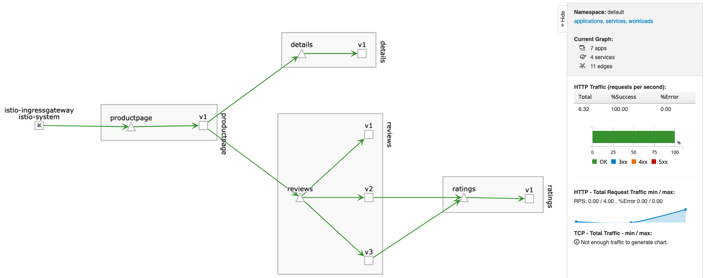

# Istio

Let's deploy Istio (and related packages) into our EKS cluster.

## Prerequesites

- Get the helm CLI from https://helm.sh website
- Deploy an EKS cluster (with the template located under 1-Create-EKS-Cluster directory)

Note: template located under '2-Helm-and-packages' directory is not a required 
step.

## Installation steps

### Istio

#### Getting Istio Helm Repository URL

First, get the latest version of Helm Istio repository by using this URL:
http://istio.io/charts

You'll redirect to the right place, for instance here:
https://gcsweb.istio.io/gcs/istio-release/releases/1.2.0/charts/ 

This URL will be used as Helm repository.

#### Installing Helm Tiller (if not done before)

If the Helm tiller is not installed yet, you have to create the dedicated
service account:

```bash
$ kubectl --kubeconfig <KUBECONFIG> apply -f tiller-rbac.yml
```

Then, installing the Tiller:

```bash
$ helm init --kubeconfig <KUBECONFIG> init --tiller-namespace kube-system --service-account tiller
```

#### Adding Istio repository

Istio Helm repo could be added like this:

```bash
$ helm repo add istio https://gcsweb.istio.io/gcs/istio-release/releases/1.2.0/charts/
$ helm repo update
```

#### Prepare the Istio installation (Istio CRD)

```bash
$ helm --kubeconfig <KUBECONFIG> install istio/istio-init --name istio-init
```

#### Istio installation 

Secret creation (for Kiali creation).

If you're using Bash shell:

```bash
$ KIALI_USERNAME=$(read -p 'Kiali Username: ' uval && echo -n $uval | base64)
$ KIALI_PASSPHRASE=$(read -sp 'Kiali Passphrase: ' pval && echo -n $pval | base64)
```

If you're using ZSH shell:
```bash
KIALI_USERNAME=$(read '?Kiali Username: ' uval && echo -n $uval | base64)
KIALI_PASSPHRASE=$(read -s "?Kiali Passphrase: " pval && echo -n $pval | base64)
```

Then, let's create the secret:

```bash
$ NAMESPACE=istio-system
$ cat <<EOF | kubectl --kubeconfig <KUBECONFIG_FILE> apply -f -
apiVersion: v1
kind: Secret
metadata:
  name: kiali
  namespace: $NAMESPACE
  labels:
    app: kiali
type: Opaque
data:
  username: $KIALI_USERNAME
  passphrase: $KIALI_PASSPHRASE
EOF
```

Finally, let's install Istio, Kiali, Grafana & Jaeger:

```bash
$ helm --kubeconfig <KUBECONFIG_FILE> install \
    --set kiali.enabled=true \
    --set grafana.enabled=true \
    --set tracing.enabled=true \
    --set tracing.ingress.enabled=true \
    --set "kiali.dashboard.jaegerURL=http://jaeger-query:16686" \
    --set "kiali.dashboard.grafanaURL=http://grafana:3000" \
    istio/istio --name istio --namespace istio
```


### Istio (without Kiali integration)

First, get the last version of Istio (here, version 1.1.5):

```bash
$ curl -L https://git.io/getLatestIstio | ISTIO_VERSION=1.1.5 sh -
$ cd istio-1.1.5
```

Then, we have to create the needed role service account for Tiller and install 
it:

```bash
$ kubectl --kubeconfig <KUBECONFIG_FILE> apply -f install/kubernetes/helm/helm-service-account.yaml
$ helm --kubeconfig <KUBECONFIG_FILE> init --service-account tiller
```

Install the istio-init chart to bootstrap all the Istio’s CRDs:

```bash
helm --kubeconfig <KUBECONFIG_FILE> install install/kubernetes/helm/istio-init --name istio-init --namespace istio-system
```

It can take a while for installing all the needed CRDs (58 CRDs).
Finally, installation of Istio himself:

```bash
helm --kubeconfig <KUBECONFIG_FILE> install install/kubernetes/helm/istio --name istio --namespace istio-system
```

### Istio (with Kiali, Grafana & Jaeger integration)

First, get the last version of Istio (here, version 1.1.5):

```bash
$ curl -L https://git.io/getLatestIstio | ISTIO_VERSION=1.1.5 sh -
$ cd istio-1.1.5
```

Then, we have to create the needed role service account for Tiller and install 
it:

```bash
$ kubectl --kubeconfig <KUBECONFIG_FILE> apply -f install/kubernetes/helm/helm-service-account.yaml
$ helm --kubeconfig <KUBECONFIG_FILE> init --service-account tiller
```

Install the istio-init chart to bootstrap all the Istio’s CRDs:

```bash
helm --kubeconfig <KUBECONFIG_FILE> install install/kubernetes/helm/istio-init --name istio-init --namespace istio-system
```

Secret creation (for Kiali creation).
If you're using Bash shell:

```bash
$ KIALI_USERNAME=$(read -p 'Kiali Username: ' uval && echo -n $uval | base64)
$ KIALI_PASSPHRASE=$(read -sp 'Kiali Passphrase: ' pval && echo -n $pval | base64)
```

If you're using ZSH shell:
```bash
KIALI_USERNAME=$(read '?Kiali Username: ' uval && echo -n $uval | base64)
KIALI_PASSPHRASE=$(read -s "?Kiali Passphrase: " pval && echo -n $pval | base64)
```

Then, let's create the secret:

```bash
$ NAMESPACE=istio-system
$ cat <<EOF | kubectl --kubeconfig <KUBECONFIG_FILE> apply -f -
apiVersion: v1
kind: Secret
metadata:
  name: kiali
  namespace: $NAMESPACE
  labels:
    app: kiali
type: Opaque
data:
  username: $KIALI_USERNAME
  passphrase: $KIALI_PASSPHRASE
EOF
```

Finally, let's install Istio, Kiali, Grafana & Jaeger:

```bash
$ helm --kubeconfig <KUBECONFIG_FILE> template \
    --set kiali.enabled=true \
    --set grafana.enabled=true \
    --set tracing.enabled=true \
    --set tracing.ingress.enabled=true \
    --set "kiali.dashboard.jaegerURL=http://jaeger-query:16686" \
    --set "kiali.dashboard.grafanaURL=http://grafana:3000" \
    install/kubernetes/helm/istio \
    --name istio --namespace istio-system | kubectl --kubeconfig <KUBECONFIG_FILE> apply -f -
```

### Install a sample application

For testing Istio/Kiali now we'll deploy a sample application.
Still inside the Istio directory, use these commands:

```bash
$ kubectl --kubeconfig <KUBECONFIG_FILE> label namespace default istio-injection=enabled
$ kubectl --kubeconfig <KUBECONFIG_FILE> apply -f samples/bookinfo/platform/kube/bookinfo.yaml
$ kubectl --kubeconfig <KUBECONFIG_FILE> apply -f samples/bookinfo/networking/destination-rule-all.yaml
```

To make the application accessible from the outside:

```bash
$ kubectl --kubeconfig <KUBECONFIG_FILE> apply -f samples/bookinfo/networking/bookinfo-gateway.yaml
```

## Accessing consoles

### Accessing Kiali console

For assessing the Kiali console, you can use the proxy feature of the kubectl command like this:

```bash
$ kubectl --kubeconfig <KUBECONFIG_FILE> -n istio-system port-forward $(kubectl --kubeconfig <KUBECONFIG_FILE> -n istio-system get pod -l app=kiali -o jsonpath='{.items[0].metadata.name}') 20001:20001
```

Then, you can access the console through this URL: http://localhost:20001/kiali/console

Here is an example of a Kiali service mesh visualization:



### Accessing Grafana console

For accessing the Grafana console, yan can use this command:

```bash
$ kubectl --kubeconfig <KUBECONFIG_FILE> -n istio-system port-forward $(kubectl --kubeconfig <KUBECONFIG_FILE> -n istio-system get pod -l app=grafana -o jsonpath='{.items[0].metadata.name}') 3000:3000 &
```

Then, you can access the console through this URL: http://localhost:3000 (no logon needed)

### Accessing Jaeger console

For accessing the Jaeger console, you can use this command:

```bash
kubectl --kubeconfig <KUBECONFIG_FILE> port-forward -n istio-system $(kubectl --kubeconfig <KUBECONFIG_FILE> get pod -n istio-system -l app=jaeger -o jsonpath='{.items[0].metadata.name}') 16686:16686
```

Open your browser to http://localhost:16686.

## Uninstallation steps

### Sample application

Still into the Istio directory use these commands:

```bash
$ kubectl --kubeconfig <KUBECONFIG_FILE> delete -f samples/bookinfo/networking/bookinfo-gateway.yaml
$ kubectl --kubeconfig <KUBECONFIG_FILE> delete -f samples/bookinfo/networking/destination-rule-all.yaml
$ kubectl --kubeconfig <KUBECONFIG_FILE> delete -f samples/bookinfo/platform/kube/bookinfo.yaml
```

### Istio

```bash
$ cd istio-1.1.5
$ helm --kubeconfig <KUBECONFIG_FILE> template \
    --set kiali.enabled=true \
    --set grafana.enabled=true \
    --set tracing.enabled=true \
    --set tracing.ingress.enabled=true \
    --set "kiali.dashboard.jaegerURL=http://jaeger-query:16686" \
    --set "kiali.dashboard.grafanaURL=http://grafana:3000" \
    install/kubernetes/helm/istio \
    --name istio --namespace istio-system | kubectl --kubeconfig <KUBECONFIG_FILE> delete -f -
$ kubectl --kubeconfig <KUBECONFIG_FILE> delete -f install/kubernetes/helm/istio-init/files
```
